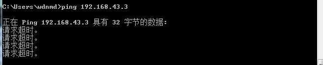

# 防火墙设置踩坑记录

## 前言

​	这次在玩耍linux防火墙（iptables）的时候踩了不少的坑，在这记录一下，这里简单做了个内网服务与外部机器通信的设置

给出本次的网络拓扑图，本次所使用的环境为3台虚拟机


## 踩坑点

### 1.输入iptables -P FORWARD ACCEPT 之后无法ping通外部主机

#### 数据转发没有打开

​	该前提条件为INPUT也开启为ACCEPT，方法一样，这里不再赘述。

​	开启forward的放行策略之后，内网机器仍然无法ping通外网机器



​	有可能是linux本身的数据转发没有打开，输入下面命令打开转发。

```
echo 1 > /proc/sys/net/ipv4/ip_forward
```

#### 目标机器没有配置路由表

​	在外部主机添加路由，假设为windows系统，则输入

```
route add 192.168.1.0 mask 255.255.255.0 192.168.43.228
```

​	如果不填加路由，机器会认为这是公网上传来的IP地址，于是回发响应走的是默认的本机路由，添加之后机器才会知道这个包要发往哪个机器


#### 虚拟机本身配置问题

​	如果linux和充当外部服务的机器都使用的网卡都为NAT模式的话，是需要修改Linux这台机器，也就是与外部交互通信的这台机器的nat规则，不能直接通过下面两条命令直接实现路由转发。

```
iptables -A FORWARD -i eth0 -o eth1 -s 192.168.1.0/24 -d any/0 -j ACCEPT   
iptables -A FORWARD -m state --state ESTABLISHED,RELATED -j ACCEPT
```

这是和老师讨论的结果

改成桥接模式之后，重新添加路由即可通信