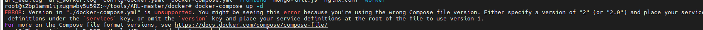
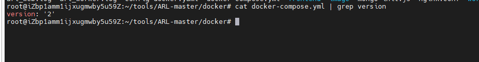
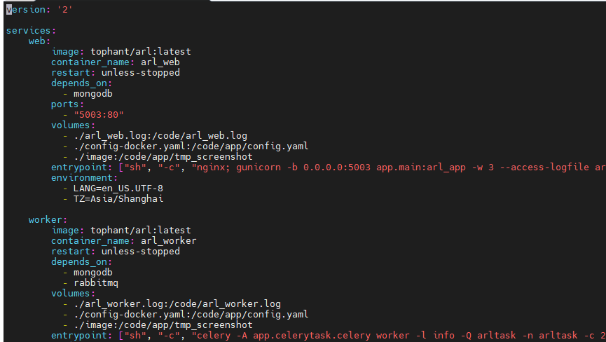
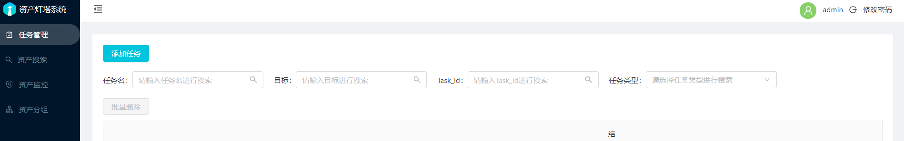

# 搭建灯塔资产收集踩坑记录

## 前言

​	之前一直想在云服务器上部署一个资产收集的系统，今天终于有时间搭建，作者还是弄得很方便了，直接使用docker搭建，不需要配置很多的环境

## 踩坑点

灯塔gayhub地址：https://github.com/TophantTechnology/ARL

按照上述步骤安装好docker和将文件clone之后，运行docker-compose up -d出现以下报错



按照报错提示说明是docker-compose.yml里的version不对，需要调成特定的版本，OK，那么我们看看yml里的version是多少

```
cat docker-compose.yml | grep version
```



这里是因为我已经修改过了，默认的应该是3，那么知道是version不对之后，我们就修改version为2

利用vim进行修改



修改完之后重新执行命令即可部署成功



