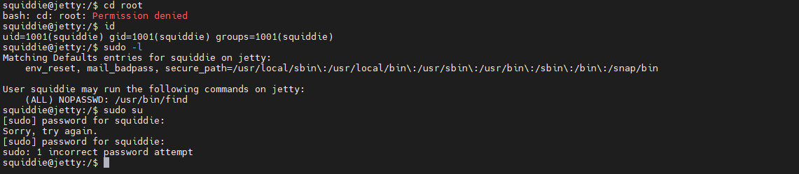

# chill_hack靶机

# Jetty靶机

## 前言

该靶机为vulnhub上的一个靶机

## 正文

``nmap -A -p- 192.168.35.156``


``dirb url``


访问80端口下的一些文件，经过探测，这些都访问不了


试试FTP吧，既然都说能匿名访问，anonymous登录，把文件get下来


一共两个文件，看了下README.txt，发现两个名字：Henry、Michael，再结合靶机描述还有个用户名：Squiddie


解压zip发现需要密码，在尝试了其他途径没找到密码，尝试爆破一下看看，利用John爆破zip，可以看那这篇文章

https://www.shuzhiduo.com/A/MyJxNM8Adn/


爆破得到密码，解压得到密码`Squ1d4r3Th3B3$t0fTh3W0rLd`，根据提示说这是公司默认密码，很有可能还有用。先尝试ssh登录，ssh开在65507端口


尝试三个用户连接，最后用squiddie登录成功，注意需要小写


发现被禁用了一系列命令，并且还会被提出连接，利用?查看允许的命令


只留下了几个命令可用，提权估计只能尝试python提


尝试在命令行利用python弹交互shell

``python -m "import pty;pty.spawn('/bin/bash')"``


发现被禁止了，既然命令行不允许，那就进python里弹


成功可以执行其他命令

去home目录下看看有几个用户


试一下能不能进root目录，发现不能，而且只能执行find命令，之后可以尝试一下利用find命令弹root的shell



先放着，去网站目录看看


```
'&%$#"!~}|{zyxwvut210/.-,+k)(!Efedcba`_^]\[ZYXWVUTpohmlkjihg`&GFEDCBA@?>=<;:
9876543210/.-,+*)('&%$#"!~}|{zyxwvutsrqponmlkjihgfedcba`_^]\[ZYXWmrkponmlkdc
b(`_dc\"`BX|?>Z<RWVUNSRKoONGLKDh+*)('&BA:?>=<;:92Vw/43,10)Mnmlkjihgfedcba`_^
]\[ZYXWVUTSRQPONMLKJIHGFEDCBA@?>=<;:9UTSRQ3ONMLKJCg*)('&%$#"!~}|{zyxwvutsrq/
(-,+*)('&}|B"b~}v{ts9wputsrqj0QPONMLKJIHGFEDCBA@?>=<;:9876543210/.-,+*)('&%$
#"!~}|{zyxwvutsr0/.-,+*)(!~%|Bcba`_^]\[ZYXWVUTSRQPONMLKJIHGFEDCBA@?>=<;:9876
543210/.-,+*)('&B$:?>=<;:3270Tu-,+O/.n,%Ijihgfedcba`_^]\[ZYXWVUTSonmlkMibgf_
^$EaZ_^]VUy<XWPOs6543210/.-,+*)('&%$#"!~}|{zyxwvutsrqponmlkjihgfedcba`_^]\[Z
YXWVUTSRQPONjihgfedcb[ZBX|\UZYRv9876543210/.-,+*)('&B$@?>=<5:381Uvutsrqpo-,+
k)"'&%|{Aba`_^]yxwYutsrqpi/PONMLKJIHGFEDCBA@?>=<;:9876543210/.-,+*)('&%$#"!~
}|{zyxwvutsrqponmlkjihgfedcba`_{]sxwvutslkji/PONMLKaf_^]ba`_^W{[ZYXWPOsMRQJI
mGLKJIHG@dDCB;:9]~6;:92Vwvutsrqponmlkjihgfe#"!~}|{zyxq7utsrTpong-NMLKJIHGFED
CBA@?>=<;:9876543210/.-,+*)('&%$#"!~}|{zyxwvutsrqponmlkjihgfedcba`_^]sxwvuts
rqjihg-,w
```

``dd69f649f3e5159ddd10b83b56b2dda2``这是在squiddie目录下找到的密文，还有一封给michael的信


拿了一堆不知道有啥用的文本，暂时至收集到这些东西，试试find提权

`sudo find user.txt -exec "/bin/bash" \;`

user.txt这个必须是要存在的文件，所以可以去Desktop目录下提权


提权成功后可以去root目录下继续收集证据


`136d05d01c8af5d3e3520d2c270f91f1`又收集到一个密文

```
解密密文
136d05d01c8af5d3e3520d2c270f91f1：836934778
dd69f649f3e5159ddd10b83b56b2dda2：2004737969
```

不知道有啥用，然后就卡关了，不知道该怎么走了，想起来之前翻var目录下有个备份backup文件夹，进去看了一下有一个passwd.bak和一个隐藏文件夹.docs


再进去看看，发现有一些报表和文件夹，下载过来看看


发现有密码保护


访问http://192.168.35.157:8000/Password_keeper/把其他的下载下来，解密一下

```
instagram T9Y0Ku/oDv80H8CUzBKkwQ==
facebook IXKnuKh73jCOKcEZAaHnIQ==
Accountabilty_not_cooked rbRH72cf3UiHXcmQB6o0OA==
MoneyBalance rRd3m80KzzTik3Eu9BRWy95GsORKwD+adfTUfPLaxVk=
Pending_to_erase aneylFYmV/jz/7g5j+Ck15oreK1VhmaKmTwa8cdSnpY=
```

usage.txt里表明`This program was compiled using pyinstaller.`,可以试试python的反编译

### pyinstaller反编译

首先下载https://github.com/extremecoders-re/pyinstxtractor工具，把exe放到目录下


反编译得到pyc文件，再利用uncompyle将pyc编成py

`pip3 install uncompyle`

然后python3反编译出现错误，查看了网上其他人的博客说是python3会报错，用python2反编译exe，那就用python2重新反编译


成功

```python
# uncompyle6 version 3.7.4
# Python bytecode 2.7 (62211)
# Decompiled from: Python 2.7.18 (default, Apr 20 2020, 20:30:41) 
# [GCC 9.3.0]
# Embedded file name: password_keeper.py
from Cryptodome.Cipher import AES
import base64
BS = 16
pad = lambda s: s + (BS - len(s) % BS) * chr(BS - len(s) % BS)
unpad = lambda s: s[0:-ord(s[(-1)])]

def cipher_message(key, message, iv):
    message = pad(message)
    key = base64.b64decode(key)
    obj = AES.new(key, AES.MODE_CBC, iv)
    ciphertext = obj.encrypt(message)
    ciphertext = base64.b64encode(ciphertext)
    return ciphertext


def decipher_message(key, ciphertext, iv):
    ciphertext = base64.b64decode(ciphertext)
    key = base64.b64decode(key)
    obj2 = AES.new(key, AES.MODE_CBC, iv)
    decipher_text = obj2.decrypt(ciphertext)
    decipher_text = unpad(decipher_text)
    return decipher_text


def generate_key(ciphertext, tag, key, iv):
    ciphertext = cipher_message(key, ciphertext, iv)
    print ''
    print "Now copy this into your database.txt (It's the free version... pay for an automated tool!)"
    print ''
    print 'Tag Password'
    print tag + ' ' + ciphertext


def show_keys(database, key, iv):
    check_permissions = raw_input('Insert password: ')
    if base64.b64encode(check_permissions) == key:
        for i in range(len(database[0])):
            ciphertext = database[1][i]
            decipher = decipher_message(key, ciphertext, iv)
            print ' '
            print 'Tag: ' + database[0][i] + ' Password: ' + decipher
            print ' '

    else:
        print ''
        print 'Tag: Instagram Password: WRONG '
        print 'Tag: Facebook  Password: PASSWORD '
        print 'Tag: SSH       Password: TRY '
        print 'Tag: root      Password: HARDER! '
        print ''


def read_database():
    database = [[], []]
    f = open('database.txt', 'r')
    for line in f.readlines():
        line = line.strip().split()
        database[0].append(line[0])
        database[1].append(line[1])

    f.close()
    return database


def main():
    print 'Welcome to the best password keeper ever!'
    print '__        __         _                _  __                         '
    print '\\ \\      / /__  __ _| | ___   _      | |/ /___  ___ _ __   ___ _ __ '
    print " \\ \\ /\\ / / _ \\/ _` | |/ / | | |_____| ' // _ \\/ _ \\ '_ \\ / _ \\ '__|"
    print '  \\ V  V /  __/ (_| |   <| |_| |_____| . \\  __/  __/ |_) |  __/ |   '
    print '   \\_/\\_/ \\___|\\__,_|_|\\_\\__,  |     |_|\\_\\___|\\___| .__/ \\___|_|   '
    print '                          |___/                    |_|   '
    iv = '166fe2294df5d0f3'
    key = 'N2FlMjE4ZmYyOTI4ZjZiMg=='
    database = read_database()
    loop = True
    while loop:
        print ''
        print 'Choose what you want to do: '
        print '1) See your passwords!'
        print '2) Generate a cipher-password'
        print '3) Close'
        option = raw_input('Insert your selection here --> ')
        if option == '1':
            print ''
            print 'Showing content of your secret passwords...'
            print ''
            show_keys(database, key, iv)
            print ''
            returned = raw_input('Press any button to return to the menu...')
        elif option == '2':
            print ''
            print ''
            title = raw_input('Type the name of the application: ')
            password = raw_input('Type the password(BEWARE OF SHOULDER SURFING!!!): ')
            generate_key(password, title, key, iv)
            print ''
            print ''
            returned = raw_input('Press any button to return to the menu...')
        else:
            if option == '3':
                loop = False
                print ''
                return 'Bye Byeeeeeeeeeeeee'
            print ''
            print ''
            print 'WHAT? FAILURE TO COMMUNICATE... Reseting connection...'
            print ''
            print ''
            returned = raw_input('Press any button to return to the menu...')


if __name__ == '__main__':
    print main()
# okay decompiling password_keeper.pyc
```

审计一波代码，发现输入1可以解密database.txt文件里的密文，但是输入的密码要与传入函数的key值要相同，看代码可以知道key值是一个base64值

```
N2FlMjE4ZmYyOTI4ZjZiMg==

解密得到：7ae218ff2928f6b2
```

得到密码


```
Tag: instagram Password: S3x1B0y


Tag: facebook Password: M4rK1sS0s3X1


Tag: Accountabilty_not_cooked Password: co8oiads13kt


Tag: MoneyBalance Password: C5Y0wzGqq4Xw8XGD


Tag: Pending_to_erase Password: 1hi2ChHrtkQsUTOc
```

解密之后就是一些资金流水表，都对应了表格名字：资金余额、待删除、没伪造的账单

